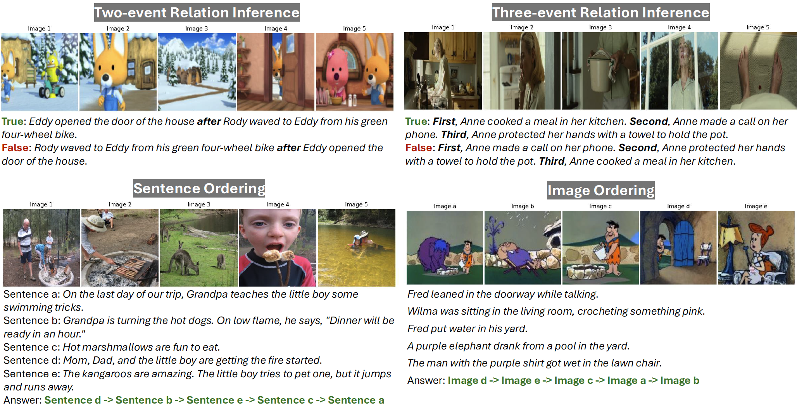

# TempVS: Temporal Grounding & Understanding Benchmark in Visual Stories

This repository contains the dataset, evaluation code and analysis scripts for our ACL 2025 Findings paper:

**Burn *After* Reading: Do Multimodal Large Language Models Truly Capture Order of Events in Image Sequences?**  
Yingjin Song, Yupei Du, Denis Paperno, Albert Gatt  
[Paper](https://aclanthology.org/2025.findings-acl.1248/) | [Dataset & Code](https://github.com/yjsong22/TempVS)

---

## 📌 Overview

**TempVS** is a benchmark designed to test **temporal grounding and reasoning** capabilities in Multimodal Large Language Models (MLLMs). TempVS evaluates models on **multi-event** understanding using **image sequences** and **textual prompts** across three main tasks:

- **MT1: Event Relation Inference** (two-event, three-event)
- **MT2: Sentence Ordering**  
- **MT3: Image Ordering**  

Each task is paired with a **Grounding Test (GT)** to assess whether errors are due to lack of visual grounding or temporal reasoning.



---

## 📦 Installation

Set up a Python environment with:

```bash
git clone https://github.com/yjsong22/TempVS.git
cd TempVS
conda create -n tempvs python=3.12
conda activate tempvs
pip install -r requirements.txt
```

---

## 🖼️ TempVS Benchmark

Our benchmark data is available at [HuggingFace](https://huggingface.co/datasets/yingjins/TempVS).

### Step 1: Download the Data

Download the dataset files (annotations, image subsets and LLM-only results for data filtering) from our [HuggingFace repository](https://huggingface.co/datasets/yingjins/TempVS). You can do this manually or using the `huggingface_hub` Python API.


### Step 2: Organize the Data

Once downloaded, make sure the files are structured as follows:

```
├── data/
│   └── benchmark/                # Annotation files (multiple-choice questions and answers)
│   └── benchmark_pkl/            # Annotation files in pkl format (used in the code, all the same as in json format)
│   └── flintstones/              # Image subset from FlintstonesSV
│       └── combined/
│       └── combined_shuffled/
│       └── video_frames_sampled_jpg/
│   └── predictions/              # Directory of predictions
│       └── blind/                # Predictions of LLMs: text only, no images
│       └── combined/             # Predictions of combined images as a sequence
│       └── separate/             # Predictions of separate images as a sequence
│   └── pororo/                   # Image subset from PororoSV
│       └── combined/
│       └── combined_shuffled/
│       └── original_color/
│   └── vist/                     # Image subset from VIST
│       └── combined/
│       └── combined_shuffled/
│       └── images/
│   └── vwp/                      # Image subset from VWP
│       └── alpha4a/
│       └── beta0/
│       └── beta1/
│       └── beta2a/
│       └── beta2b/
│       └── beta2c/
│       └── combined/
│       └── combined_shuffled/
```

Each image subset directory (e.g., `data/flintstones/`) should contain the sampled images used in the benchmark. The annotation files should be placed directly under `data/benchmark/`.


Alternatively, you can download from original datasets [FlintstonesSV](https://aclanthology.org/2021.emnlp-main.543/), [PororoSV](https://openaccess.thecvf.com/content_CVPR_2019/papers/Li_StoryGAN_A_Sequential_Conditional_GAN_for_Story_Visualization_CVPR_2019_paper.pdf), [VIST](https://visionandlanguage.net/VIST/dataset.html) and [VWP](https://huggingface.co/datasets/tonyhong/vwp), and process them by running `process_data/select_{dataset}.py` and `process_data/generate_prompts.py`.

---

## 🖥️ Experiments & Evaluation

Example usage:

Data sources: `flintstones`, `pororo`, `vist`,  `vwp`,

1. **Event Relation Inference (MT1)**: `paired_event_discrimination` (two-event relation), `triple_event_discrimination` (three-event relation), 
```bash
python run_inference.py --data_source flintstones --task paired_event_discrimination --model_id OpenGVLab/InternVL2_5-78B-MPO
python run_inference.py --data_source flintstones --task triple_event_discrimination --model_id OpenGVLab/InternVL2_5-78B-MPO
```

2. **Sentence Ordering (MT2)**: `ordering_texts_opt_event` (event),  `ordering_texts_opt_story` (story), 
```bash
python run_inference.py --data_source pororo --task ordering_texts_opt_event --model_id microsoft/Phi-3.5-vision-instruct
python run_inference.py --data_source pororo --task ordering_texts_opt_story --model_id microsoft/Phi-3.5-vision-instruct
```

3. **Image Ordering (MT3)**: `ordering_images_opt_event` (event),  `ordering_images_opt_story` (story), 
```bash
python run_inference.py --data_source vist --task ordering_images_opt_event --model_id llava-hf/llava-interleave-qwen-7b-hf
python run_inference.py --data_source vist --task ordering_images_opt_story --model_id llava-hf/llava-interleave-qwen-7b-hf
```

4. **Grounding Test (GT)**: `paired_grounding_one_text` (MT1 two-event grounding), `triple_grounding_one_text` (MT1 three-event grounding), `single_grounding_all` (MT2 & MT3 event grounding), `single_grounding_all_story` (MT2 & MT3 story grounding)

```bash
python run_inference.py --data_source vwp --task paired_grounding_one_text --model_id TIGER-Lab/Mantis-8B-Idefics2
python run_inference.py --data_source vwp --task triple_grounding_one_text --model_id TIGER-Lab/Mantis-8B-Idefics2
python run_inference.py --data_source vwp --task single_grounding_all --model_id TIGER-Lab/Mantis-8B-Idefics2
python run_inference.py --data_source vwp --task single_grounding_all_story --model_id TIGER-Lab/Mantis-8B-Idefics2
```


## 📊 Performance Evaluation

```bash
python run_evaluation.py
```

---

## 📜 Citation

```bibtex
@inproceedings{song-etal-2025-tempvs,
  title = {Burn After Reading: Do Multimodal Large Language Models Truly Capture Order of Events in Image Sequences?},
  author = {Song, Yingjin and Du, Yupei and Paperno, Denis and Gatt, Albert},
  booktitle = {Findings of the Association for Computational Linguistics: ACL 2025},
  year = {2025},
  url = {https://aclanthology.org/2025.findings-acl.1248/}
}
```

---

## 🔒 License

TempVS is released under the **Apache 2.0 License**.  
Original datasets (FlintstonesSV, PororoSV, VIST, VWP) retain their licenses.

